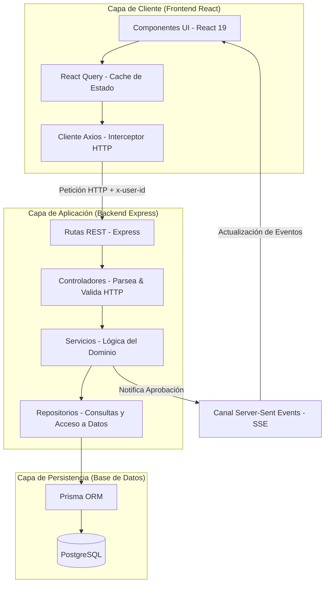
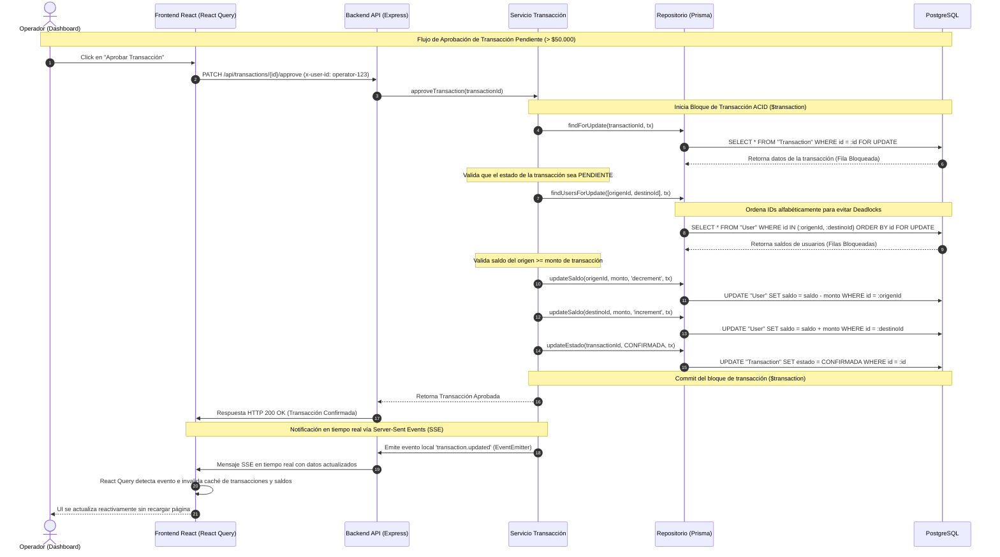

# Arquitectura del Sistema - Mini Plataforma Fintech

Este documento detalla el diseño arquitectónico, los patrones de diseño y los mecanismos de concurrencia y consistencia de datos implementados en la Mini Plataforma Fintech. La solución ha sido construida para garantizar **atomicidad transaccional**, **prevención de condiciones de carrera**, **cero sobregiros de saldo** y **actualizaciones en tiempo real**.

---

## 1. Diagramas Arquitectónicos

Para facilitar la comprensión del sistema, la arquitectura se divide en dos diagramas específicos: la separación física e infraestructural de capas y la secuencia del procesamiento de pagos concurrentes.

### A. Diagrama de Infraestructura y Capas
Este diagrama muestra la separación estricta de responsabilidades en capas lógicas e independientes del sistema, garantizando la mantenibilidad, escalabilidad y la inyección limpia de dependencias.



---

### B. Diagrama de Secuencia de Aprobación de Transacciones (> $50.000)
Muestra el flujo exacto que sigue una transferencia que excede los $50.000 desde el momento en que el operador la aprueba de forma manual hasta que impacta la base de datos y se propaga reactivamente al frontend mediante Server-Sent Events.



---

## 2. Decisiones de Diseño y Patrones

### Patrón Controller-Service-Repository
El backend en Express se ha estructurado dividiendo el código en tres capas bien definidas:
1.  **Capa de Controladores (`Controllers`)**: Actúa como el punto de entrada de las peticiones HTTP. Valida la estructura y formato de los parámetros de entrada empleando esquemas de Zod, intercepta errores de parseo y delega la ejecución al servicio.
2.  **Capa de Servicios (`Services`)**: Es el corazón del negocio fintech. Contiene las reglas operativas de la plataforma (por ejemplo, validación de montos mayores a $50.000 para forzar el estado `PENDIENTE`, comprobación de fondos y control de identidades). No sabe de protocolos de comunicación ni de conexiones directas a SQL.
3.  **Capa de Repositorios (`Repositories`)**: Abstrae las interacciones físicas con la base de datos a través de Prisma Client. Centraliza las consultas, escrituras y consultas nativas SQL como la adquisición de bloqueos exclusivos.

#### Ventaja Crítica de Testabilidad:
Este patrón nos permite mockear por completo el acceso a datos en las pruebas unitarias. Mediante la inyección de repositorios mockeados (ej. `jest.mock`), podemos testear de forma exhaustiva las reglas de negocio complejas de los servicios (por ejemplo, validar que se arroje una excepción de negocio ante un balance insuficiente) en milisegundos, sin depender de una base de datos real levantada ni de conexiones de red.

---

## 3. Concurrencia, Consistencia y Prevención de Deadlocks

En sistemas financieros de transferencia de saldo, la integridad de los datos es la prioridad máxima. El doble gasto (*double spending*) o sobregiro es una vulnerabilidad inaceptable que ocurre si dos transacciones concurrentes intentan retirar saldo del mismo origen simultáneamente.

### Bloqueo Pesimista vs. Bloqueo Optimista
*   **Bloqueo Optimista**: Supone que las colisiones son raras. Añade un campo de versión a la tabla y realiza la actualización solo si la versión no ha cambiado. Si colisiona, se revierte y requiere reintentos. En sistemas de alto flujo de transacciones sobre cuentas calientes (por ejemplo, cuentas concentradoras corporativas), el bloqueo optimista genera una alta tasa de fallos de transacciones por conflictos de versión, degradando la experiencia de usuario.
*   **Bloqueo Pesimista (`SELECT ... FOR UPDATE`)**: Se asume activamente que ocurrirán conflictos. Bloquea físicamente las filas de la base de datos PostgreSQL desde el inicio de la transacción. Cualquier otra transacción concurrente que intente leer o escribir sobre esas filas quedará en cola de espera hasta que la transacción en curso realice `COMMIT` o `ROLLBACK`. **Esta es la estrategia ideal para transferencias monetarias, garantizando consistencia absoluta.**

### Prevención Algorítmica de Deadlocks (Interbloqueos)
Un interbloqueo (*deadlock*) ocurre cuando dos transacciones bloquean recursos y quedan en espera mutua.

> **Ejemplo de Deadlock clásico:**
> - Transacción A intenta transferir de **Usuario 1** a **Usuario 2**: Bloquea **Usuario 1** y espera bloquear **Usuario 2**.
> - Transacción B (concurrente) intenta transferir de **Usuario 2** a **Usuario 1**: Bloquea **Usuario 2** y espera bloquear **Usuario 1**.
> - **Resultado**: Ambos procesos se bloquean indefinidamente esperando al otro hasta que la base de datos detecta el conflicto y aborta una de ellas.

#### Solución Implementada: Ordenamiento Determinista de IDs
Para erradicar este problema de raíz, en el repositorio [user.repository.ts](file:///c:/Users/mfgom/Desktop/mini_plataforma_fintech/backend/src/repositories/user.repository.ts#L10-L19) aplicamos un ordenamiento determinista de los UUIDs involucrados antes de la consulta SQL:

```typescript
async findUsersForUpdate(ids: string[], tx: Prisma.TransactionClient): Promise<User[]> {
  if (ids.length === 0) return [];
  return await tx.$queryRaw<User[]>`
    SELECT * FROM "User"
    WHERE id = ANY(${ids}::uuid[])
    ORDER BY id
    FOR UPDATE
  `;
}
```

Al ordenar alfabéticamente los IDs (`ORDER BY id`), garantizamos que sin importar cuál sea el remitente o el destinatario, **ambas transacciones siempre adquirirán los bloqueos exactamente en el mismo orden** (primero el ID con menor valor alfanumérico, luego el mayor). 
- Si la Transacción A y la Transacción B involucran a los mismos dos usuarios, ambas intentarán bloquear a **Usuario 1** primero.
- La transacción que obtenga el bloqueo de **Usuario 1** procederá a bloquear a **Usuario 2** sin conflicto.
- La segunda transacción esperará pacientemente en cola por **Usuario 1** antes de tomar cualquier otro bloqueo, eliminando por completo los ciclos de espera mutua y, por ende, previniendo los deadlocks.

---

## 4. Garantías ACID mediante Prisma `$transaction`

La atomicidad de las operaciones financieras está respaldada por el soporte interactivo de transacciones de Prisma (`prisma.$transaction`). Este método envuelve todas las escrituras y consultas en una única transacción de base de datos PostgreSQL, garantizando las siguientes propiedades:

*   **Atomicidad (Atomicity)**: O se debitan los fondos del origen, se acreditan en el destino y se actualiza el estado de la transacción a `CONFIRMADA` conjuntamente, o no se realiza ninguna de las tres operaciones (haciendo un `ROLLBACK` automático ante cualquier error o validación fallida).
*   **Consistencia (Consistency)**: La base de datos siempre pasa de un estado válido a otro. La restricción de saldos positivos e integridad referencial (llaves foráneas en transacciones) está validada a nivel de esquema relacional.
*   **Aislamiento (Isolation)**: Empleando bloqueos pesimistas, las transacciones concurrentes operan de manera aislada evitando "lecturas sucias" (dirty reads) y garantizando lectura repetible.
*   **Durabilidad (Durability)**: Una vez que el bloque transaccional hace commit exitoso, los cambios de saldos son escritos permanentemente en el almacenamiento persistente no volátil de PostgreSQL.

---

## 5. Arquitectura de Actualización en Tiempo Real (SSE)

Para lograr un sistema de notificaciones de baja latencia y optimizar el consumo de recursos de red en el cliente, se optó por **Server-Sent Events (SSE)** en lugar de WebSockets.

### ¿Por qué SSE frente a WebSockets?
1.  **Unidireccionalidad**: El frontend solo necesita enterarse de cambios aprobados en el backend para refrescar sus paneles. No necesita enviar datos a través del canal persistente (las acciones de crear, aprobar o rechazar se realizan mediante peticiones estándar HTTP POST/PATCH).
2.  **Protocolo HTTP Estándar**: SSE funciona sobre HTTP tradicional (`text/event-stream`), lo que evita problemas de compatibilidad con proxies, firewalls corporativos o balanceadores de carga que suelen bloquear el protocolo WebSockets (`ws://`).
3.  **Reconexión Automática**: El navegador, a través del objeto nativo `EventSource`, maneja automáticamente la reconexión con el servidor si el canal se cae de forma temporal, sin necesidad de librerías externas o lógica compleja en React.
